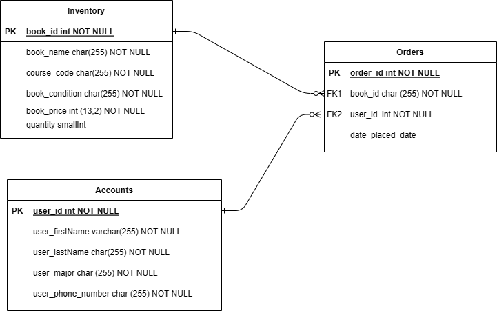
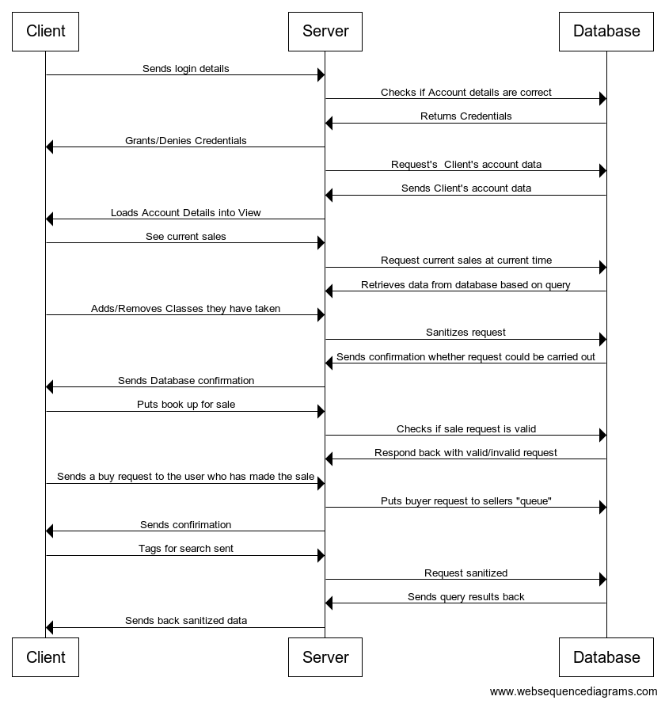

# racoon-bazaar

Best marketplace in the world :D

nodeJS Libraries/Frameworks/etc Used: 

    -body-parser: for processing HTTP request data
    
    -dotenv: for creation and use of environment variables for things such as database info, api keys, etc
    
    -express: for server handling
    
    -mysql2: for database handling

Iteration 1 Progress on Backend:

    -Server is set to receive requests from HTML views.
    
    -Server is set to send requests to the AWS database.
    
    -Server is able to turn those requests into SQL statements that can then be used to search/insert to database.
    
End Result:

    -Server is able to take client requests and send them off to the database. 
    -The database returns its data to the server, where currently the data
    is being sent as a raw JSON object file
    

Iteration 2 Plans on Backend:

    -Code refactoring (Attempt to reduce the amount of search functions)
    -Sanitizing input
    -Sculpt JSON object output into something more presentable
    -Begin a table to house accounts
    -Relate accounts to buy and sell requests

Iteration 1 Sequence Diagram:

Iteration 1 Database Class Diagram:

Iteration 2 Database Class Diagram:

Iteration 2 Sequence Diagrams:

